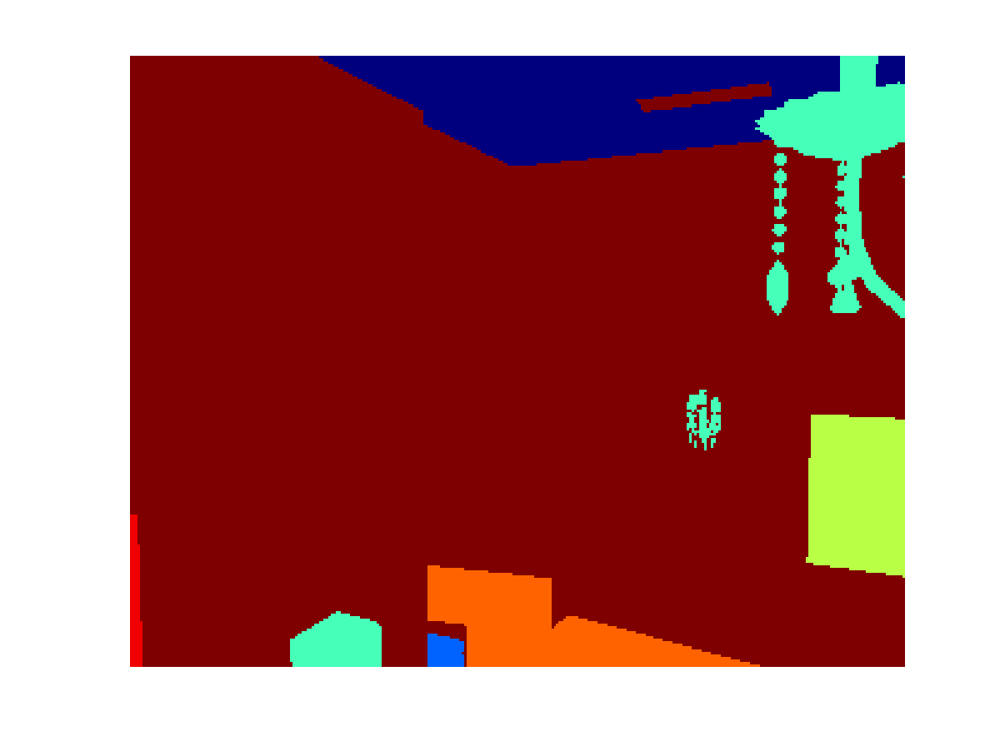

# pySceneNetRGBD

A set of python3 scripts showing examples of how to navigate and access the core elements of the data within the SceneNetRGBD dataset.

# Requirements

* python3
* numpy
* PIL
* protobuf

# protobuf installation

Make sure you install protobuf with pip3 

```
pip3 install protobuf
```

# Dataset structure

The dataset consists of two components.  The first component is a set of files organised into trajectory folders.  Each of these folders contains three directorys:

* photo - which contains the photorealistic renders, each of which is named after its frame_num (e.g. 0.jpg is the first pose, 25.jpg the next)
* depth - which contains the accompanying depth information stored as unsigned 16-bit integers within a PNG. The numbering scheme is the same as for photo (0.png is the first frame).  The units are millimeters, a value of 1000 is a meter. Depth is defined as the euclidean ray length from the camera position to the first point of intersection.
* instance - which contains instances labels for a trajectory also in unsigned 16-bit integers.  Instance 1 is the first object and will be the same through all of the frames within this folder

The second component is a protobuf file.  The definition of this protobuf is given in scenenet.proto.  It stores a list of trajectories, with the attribute 'render_path' which points towards the appropriate folder for the renders of that trajectory.  The protobuf also stores a set of views, each with a 'frame_number' telling you which number within photo/depth/instance is applicable to that view.  The view contains both a timestamp and the camera position and lookat positions.

The protobuf also stores instances for each trajectory, with each instance having an 'instance_id'.  This instance_id provides a mapping from the instance information stored in the protobuf and the instances rendered in the instance folder.  If a pixel within the instance/0.png is 1 then at that pixel, the instance within this trajectory with the 'instance_id' of 1 stores all of the relevant information for this object.  That information depends on the 'instance_type', but for everthing except background includes a wordnet id semantic label.

# How to get started with the validation set

* Download the validation set (15GB) and the validation set protobuf file from the [SceneNet RGB-D project page](http://robotvault.bitbucket.io/scenenet-rgbd.html).

* Extract the validation set (```tar -xvzf val.tar.gz```), to a location on you local machine. To avoid editing more code, you can place it directly within the data directory of this repo data/val, or optionally place it somewhere else, and edit line 4 of the read_protobuf.py file to point towards the folder location.


* This validation folder should contain a single folder 0, with 1,000 folders in it for each of the validation trajectories.

* Copy the protobuf file to data folder of this repo.

* Run make in the root folder of the repo to generate the protobuf description

* Run the read_protobuf.py to print out information about a single trajectory (remove the final break to print our information about them all)

```
python3 read_protobuf.py
```
    
* You should see a print out of the information available for one of the trajectories within the dataset.

* It prints the meta data related to all different objects there are in the scene. This includes the layout objects *i.e* wall, ceiling and floor etc. as well as the random objects present in the scene. 

* For each random object it prints its location and the rotation matrix to give the pose. 

* It also prints out the trajectory with shutter open and shutter close times.

```
Number of trajectories:1000
====================
Render path:0/223
Layout type:KITCHEN path:kitchen/kitchen6_layout.obj
====================

Number of instances: 49
====================
Instance id:0
Instance type:BACKGROUND
--------------------

====================
Instance id:1
Instance type:LAYOUT_OBJECT
Wordnet id:02990373
Plain english name:ceiling
--------------------

====================
Instance id:2
Instance type:LAYOUT_OBJECT
Wordnet id:03005285
Plain english name:chandelier
--------------------

====================
Instance id:8
Instance type:LIGHT_OBJECT
Wordnet id:03665924
Plain english name:lightbulb
Light type:PARALLELOGRAM
--------------------

====================
Instance id:9
Instance type:RANDOM_OBJECT
Wordnet id:04379243
Plain english name:table
Object info:shapenet_hash: "04379243/68247c737f565de8615b3e12f53b391d"
height_meters: 0.8016070127487183
object_pose {
  translation_x: -4.49629020690918
  translation_y: 0.23743900656700134
  translation_z: 4.469130039215088
  rotation_mat11: 0.9999970197677612
  rotation_mat12: 0.0011692900443449616
  rotation_mat13: 0.002182639902457595
  rotation_mat21: -0.0011747500393539667
  rotation_mat22: 0.9999960064888
  rotation_mat23: 0.0025000099558383226
  rotation_mat31: -0.0021797099616378546
  rotation_mat32: -0.002502569928765297
  rotation_mat33: 0.9999939799308777
}

--------------------

====================
Instance id:10
Instance type:RANDOM_OBJECT
Wordnet id:04590933
Plain english name:windsorchair
Object info:shapenet_hash: "03001627/30afd2ef2ed30238aa3d0a2f00b54836"
height_meters: 0.7883989810943604
object_pose {
  translation_x: 0.3437049984931946
  translation_y: 0.24061700701713562
  translation_z: 0.38801801204681396
  rotation_mat11: 0.9985309839248657
  rotation_mat12: -0.0009748529992066324
  rotation_mat13: 0.05417810007929802
  rotation_mat21: 0.0009531180257909
  rotation_mat22: 0.9999989867210388
  rotation_mat23: 0.00042701399070210755
  rotation_mat31: -0.054178498685359955
  rotation_mat32: -0.00037474901182577014
  rotation_mat33: 0.9985309839248657
}

--------------------

====================
Instance id:11
Instance type:RANDOM_OBJECT
Wordnet id:03957315
Plain english name:planter
Object info:shapenet_hash: "03991062/8d2c6ce685eb1fd9368b14e48c164a6e"
height_meters: 0.9080100059509277
object_pose {
  translation_x: 2.965019941329956
  translation_y: 0.2490839958190918
  translation_z: 4.6422200202941895
  rotation_mat11: 0.9911879897117615
  rotation_mat12: 0.008519629947841167
  rotation_mat13: 0.13218699395656586
  rotation_mat21: -0.018325600773096085
  rotation_mat22: 0.9971529841423035
  rotation_mat23: 0.07314439862966537
  rotation_mat31: -0.13118800520896912
  rotation_mat32: -0.07492230087518692
  rotation_mat33: 0.9885219931602478
}

--------------------

Render path:0/223
data/val/0/223/photo/0.jpg
data/val/0/223/instance/0.png
data/val/0/223/instance/0.png
frame_num: 0
shutter_open {
  camera {
    x: 2.0335700511932373
    y: 0.5862889885902405
    z: 4.062709808349609
  }
  lookat {
    x: 2.127110004425049
    y: 1.815809965133667
    z: 3.522209882736206
  }
  timestamp: 0.0
}
shutter_close {
  camera {
    x: 2.033060073852539
    y: 0.5861700177192688
    z: 4.060299873352051
  }
  lookat {
    x: 2.128920078277588
    y: 1.8188899755477905
    z: 3.5255000591278076
  }
  timestamp: 0.016666699200868607
}

data/val/0/223/photo/25.jpg
data/val/0/223/instance/25.png
data/val/0/223/instance/25.png
frame_num: 25
shutter_open {
  camera {
    x: 2.041440010070801
    y: 0.583545982837677
    z: 3.9235999584198
  }
  lookat {
    x: 2.255579948425293
    y: 2.0147199630737305
    z: 3.720639944076538
  }
  timestamp: 1.0
}
shutter_close {
  camera {
    x: 2.041670083999634
    y: 0.5835520029067993
    z: 3.921649932861328
  }
  lookat {
    x: 2.2581300735473633
    y: 2.0179998874664307
    z: 3.7238099575042725
  }
  timestamp: 1.0166699886322021
}

```

# Example code for converting Instance to NYUv2 13 Semantic Classes

* Run the convert_instance2class.py to map a random instance image taken from a dataset to its corresponding 13 class semantic image.

* These 13 semantic categories are as given in NYUv2. 

* The code will take some time but it will write an image 'semantic_class.png' in the same directory where each pixel has an index value encoding the semantic category.

* If you use MATLAB or octave, you can view the image with following commands 

```
I = imread('semantic_class.png')

imagesc(I)
```
* Additionally it writes another file called 'NYUv2.png' where each category is colour coded as in SceneNet


One of our sample 'semantic_class.png' image looks like 

<br><br><br><br><br><br><br><br><br><br>


# Notes

There was a typo in the original paper stating that the vertical Field of View of the camera used for the dataset was 40 degrees, but it is in fact 45 degrees. The code in this repository and camera intrinsic matrix provided use the correct 45 degree vFoV.

```

# License
GPL. We would like to thank Dyson Technologies Limited for supporting this work.
